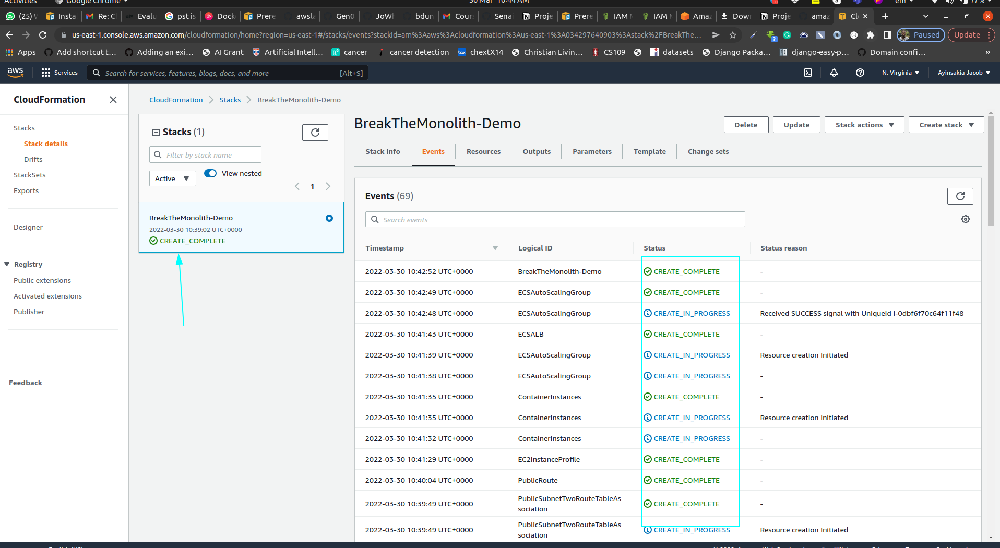
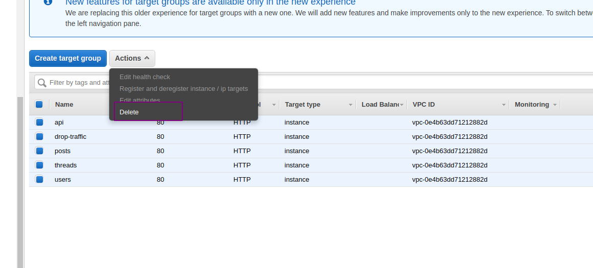

# Monolith-Application

Break a Monolith Application into Microservices with Amazon Elastic Container Service, Docker, and Amazon EC2

In this project, i will deploy a monolithic node.js application to a Docker container, then decouple the application into microservices without any downtime. The node.js application hosts a simple message board with threads and messages between users.

Why does this matter?

Traditional monolithic architectures are hard to scale. As an application's code base grows, it becomes complex to update and maintain. Introducing new features, languages, frameworks, and technologies becomes very hard, limiting innovation and new ideas.

Within a microservices architecture, each application component runs as its own service and communicates with other services via a well-defined API. Microservices are built around business capabilities, and each service performs a single function. Microservices can be written using different frameworks and programming languages, and you can deploy them independently, as a single service, or as a group of services.

  PROJECT MODULES/ STEPS

 1. Module One - Containerize the Monolith

 2. Module Two - Deploy the Monolith

 3. Module Three - Break the Monolith

 4. Module Four - Deploy Microservices

 5. Module Five - Clean Up

     MODULE 1 - CONTAINERIZE THE MONOLITH

 What is a Container?

Containers allow you to easily package an application's code, configurations, and dependencies into easy to use building blocks that deliver environmental consistency, operational efficiency, developer productivity, and version control. Containers can help ensure that applications deploy quickly, reliably, and consistently regardless of deployment environment

Why use containers? 

Because of Speed, Dependency Control & Improved Pipeline,Density & Resource Efficiency, Flexibility.

  IMPLEMENTATION INSTRCTIONS

 For the first part of this project, I will build the Docker container image for my monolithic node.js application and push it to Amazon Elastic Container Registry (Amazon ECR).

In the next few steps, I will be using Docker, Github, Amazon Elastic Container Service (Amazon ECS), and Amazon ECR to deploy code into containers. To complete these steps, ensure you have the following tools.

Prerequisites
1- Have an Aws account.

2- Install Docker.

3- Install the AWS CLI.

4- Have a text editor(Atom is recommended).

 1. Have an AWS account

2. Installing Docker
You will use Docker to build the image files that will run in your containers.
1

After Docker is installed, you can verify it is running by entering docker --version in the terminal. The version number should display, for example: 

Docker version 19.03.5, build 633a0ea

                        3.INSTALLING THE AWS CLI

I. You will use the AWS Command Line Interface (AWS CLI) to push the images to Amazon ECR. You can learn about and download AWS CLI [here](http://docs.aws.amazon.com/cli/latest/userguide/installing.html).

II. After AWS CLI is installed, verify it is running by entering *aws --version* in the terminal. The version number should display, for example:

aws-cli/1.16.217 Python/2.7.16 Darwin/18.7.0 botocore/1.12.207

III.If you already have AWS CLI installed, run the following command in the terminal to ensure it is updated to the latest version: 

pip install awscli --upgrade --user

IV. If you have never used AWS CLI before, you may need to configure your credentials.

                    4. HAVE A TEXT EDITOR
I. Have a text editor: If you don't already have a text editor for coding, install one to your local environment. Atom is a simple, open-source text editor from GitHub that is popular with developers.

**Download the code from GitHub:** Navigate to [https://github.com/awslabs/amazon-ecs-nodejs-microservices](https://github.com/awslabs/amazon-ecs-nodejs-microservices) and select **Clone or Download** to download the GitHub repository to your local environment. You can also use [GitHub Desktop](https://desktop.github.com/) or [Git](https://git-scm.com/) to clone the repository.

III. **Open the project files:** Start **Atom**, select **Add Project Folder**, and select the folder where you saved the repository **amazon-ecs-nodejs-microservices.** This will add the entire project into Atom so you can easily work with it.In your project folder, you should see folders for **infrastructure** and **services**. Infrastructure holds the AWS CloudFormation infrastructure configuration code you will use in the next step. **Services** contains the code that forms the node.js application.Take a few minutes to review the files and familiarize yourself with the different aspects of the application, including the database **db.json**, the server **server.js**, **package.json**, and the application **Dockerfile**.

           NEXT STEP CREATE THE REPOSITORY

I. Navigate to the [Amazon ECR console](https://console.aws.amazon.com/ecs/home?#/repositories).

II.  On the **Repositories** page, select **Create Repository**.

III.  On the Create repository page, enter the following name your repository: *api* **Note:** Under **Tag immutability**, leave the default settings.

IV.  Select **Create repository**.

Access your terminal and navigate to the following directory: *~/amazon-ecs-nodejs-microservices/2-containerized/services/api*.

**Use the terminal to authenticate Docker log in:**

1. run

After the repository is created, a confirmation message showing with the repository address. The repository address is in the following format: ***[account-ID]*.dkr.ecr.*[region]*.amazonaws.com/*[repo-name]***. The *[account-ID]*, *[region]*, and *[repo-name]* will be specific to your setup.

If needed, [configure your credentials](http://docs.aws.amazon.com/cli/latest/userguide/cli-chap-getting-started.html).If the authentication was successful, you will receive the confirmation message: **Login Succeeded**.

I.  To build the image, run the following command in the terminal: *docker build -t api* .

II. **Note:** **The period (**.**) after *api* is needed.

III. After the build completes, tag the image so you can push it to the repository:

docker tag api:latest [account-ID].dkr.ecr.[region].amazonaws.com/api:v1 

IV. Note: Replace the [account-ID] and [region] placeholders with your specific information.Pro tip: The :v1 represents the image build version. 

V.Push the image to Amazon ECR by running: docker push [account-id].dkr.ecr.[region].amazonaws.com/api:v1  

VI. **Note:** replace the [account-ID] and [region] placeholders with your specific information.

If you navigate to your Amazon ECR repository, you should see your image tagged *v1*.

                 MODULE TWO DEPLOYING THE MONOLITH

In this module, i will use Amazon Elastic Container Service (Amazon ECS) to instantiate a managed cluster of EC2 compute instances and deploy your image as a container running on the cluster. 

Here, the architecture woud include the Client, Load Balancer, Target Groups, Container ports and the Containerized node.js Monolith and the services used are Amazon Elastic Container Service,Amazon Elastic Container Registry ,AWS CloudFormation and Elastic Load Balancing.

               
                IMPLEMENTATION INSTRUCTION

Follow the step-by-step instructions below to deploy the node.js application using Amazon ECS. Select each step number to expand the section.

Create an Amazon ECS cluster deployed behind an Application Load Balancer.

STEP 1
1. Navigate to the [AWS CloudFormation console](https://console.aws.amazon.com/cloudformation/home).
2. Select **Create stack**.
3. Select **Upload a template file** and choose the [ecs.yml](https://github.com/awslabs/amazon-ecs-nodejs-microservices/blob/master/2-containerized/infrastructure/ecs.yml) file from the GitHub project at *amazon-ecs-nodejs-microservice/2-containerized/infrastructure/ecs.yml* then select **Next**.
4. For the stack name, enter *BreakTheMonolith-Demo*. Verify that the other parameters have the following values:
    1. Desired Capacity = *2*
    2. InstanceType = *t2.micro*
    3. MaxSize = *2*
5. Select **Next***.*
6. On the **Configure stack options** page, keep the default options and scroll down and select **Next**.
7. On the **Review BreakTheMonolith-Demo** page scroll to the bottom of the page, acknowledge the **Capabilities** statement by selecting the checkbox, and select **Create stack**.

You will see your stack with the status CREATE_IN_PROGRESS. You can select the refresh button at the top right of the screen to check on the progress.

 STEP 2 CHECK IF CLUSTER IS RUNNING

I. Navigate to the Amazon ECS console.Your cluster should appear in the list.

II. Select the cluster BreakTheMonolith-Demo, then select the Tasks tab to verify that there are no tasks running.

III. Select the ECS Instances tab to verify there are two Amazon EC2 instances created by the AWS CloudFormation template.⚐ Note: If you receive a message that the ECS agent is outdated, select Learn more for instructions to update the ECS agent.

Task definitions specify how Amazon ECS deploys the application containers across the cluster.

IV.  From the **Amazon ECS** left navigation menu, select **Task Definitions**.

V. Select **Create new Task Definition**
 
VI.On the **Select launch type compatibility** page, select the **EC2** option then select **Next step**.

VII. On the **Configure task and container definitions** page, do the following:
   
 - In the **Task Definition Name** field, enter *api*.

    - Scroll down to **Container Definitions** and select **Add container**.

    - In the **Add container** window:
        - Parameters that are not defined can be either left blank or with the default settings.
        - In the **Container name** field, enter *api*.
        - In the **Image** field, enter *[account-ID].dkr.ecr.[region].amazonaws.com/api:v1*Replace *[account-ID]* and *[region]* with your specific information. Ensure the tag *v1* matches the value you used in Module 1 to tag and push the image. This is the URL of your ECR repository image that was created in the previous module.
        - In the **Memory Limits** field, verify **Hard limit** is selected and enter *256* as the value.
        - Under **Port mappings**, Host port = *0* and Container port = *3000*.
        - Scroll to **ENVIRONMENT**, CPU units = *256*.

VIII. Select **Add**.You will return to the **Configure task and container definitions** page.

XI. Scroll to the bottom of the page and select **Create**.

  APPLICATION LOAD BALANCER

The [Application Load Balancer (ALB)](http://docs.aws.amazon.com/elasticloadbalancing/latest/application/introduction.html) lets your service accept incoming traffic. The ALB automatically routes traffic to container instances running on your cluster using them as a [target group](http://docs.aws.amazon.com/elasticloadbalancing/latest/application/load-balancer-target-groups.html).

CHECKING YOUR VPC NAME

If this is not your first time using this AWS account, you may have multiple VPCs. It is important to configure your Target Group with the correct VPC.

I.  Navigate to the [Load Balancer section of the EC2 Console](https://console.aws.amazon.com/ec2/v2/home?#LoadBalancers:).

II. Locate the Load Balancer named **demo**.

III. Select the checkbox next to **demo** to see the Load Balancer details.

IV. In the **Description** tab, locate the **VPC** attribute (in this format: vpc-xxxxxxxxxxxxxxxxx). **Note:** You will need the VPC attribute in the next step when you configure the ALB target group.

            CONFIGURE THE ALB TARGET GROUP

I. Navigate to the [Target Group section of the EC2 Console.](https://console.aws.amazon.com/ec2/v2/home?#TargetGroups:)

II.Select **Create target group**.

III. Configure the following Target Group parameters (for the parameters not listed below, keep the default values):
    - For the **Target group name**, enter *api*.
    - For the **Protocol**, select **HTTP**.
    - For the **Port**, enter *80*.
    - For the VPC, select the value that matches the one from the Load Balancer description. .
        
       NB: This is most likely NOT your default VPC
        
    - Access the **Advanced health check settings** and edit the following parameters as needed:
        - For **Healthy threshold**, enter *2*.
        - For **Unhealthy threshold**, enter *2*.
        - For **Timeout**, enter *5*.
        - For **Interval**, enter *6*.

IV. Select **Create**.

      ADDING A LISTENER TO THE ALB.

I. Navigate to the [Load Balancer section of the EC2 Console](https://console.aws.amazon.com/ec2/v2/home?#LoadBalancers:).

II. Select the checkbox next to **demo** to see the Load Balancer details.

III. Select the **Listeners** tab.

IV. Select **Add listener** and edit the following parameters as needed:
    - For **Protocol:port**, select **HTTP** and enter *80*.
    - For **Default action(s)**, select **Forward to** and in the **Target group** field, enter *api*.

V.Select **Save**.

            DEPLOYING THE MONOLITH AS A SERVICE INTO CLUSTER

I. Navigate to the [Amazon ECS console](https://console.aws.amazon.com/ecs/home?) and select **Clusters** from the left menu bar.

II. Select the cluster **BreakTheMonolith-Demo**, select the **Services** tab then select **Create**.

III. On the **Configure service** page, edit the following parameters (and keep the default values for parameters not listed below):
    - For the **Launch type**, select **EC2**.
    - For the **Service name**, enter *api*.
    - For the **Number of tasks**, enter *1*.
    - Select **Next step**.
IV. On the **Configure network** page, **Load balancing** section, select **Application Load Balancer**.Additional parameters will apear: **Service IAM role** and **Load balancer name**.
    - For the **Service IAM role**, select BreakTheMonolith-Demo-ECSServiceRole.
    - For the **Load balancer name**, verify that **demo** is selected.

V. In the **Container to load balance** section, select **Add to load balancer**.Additional information labeled **api:3000** is shown.

VI. In the **api:3000** section, do the following:
    - For the **Production listener port** field, select **80:HTTP**.
    - For the **Target group name**, select your group: **api**.
    - Select **Next step**.
VII.  On the **Set Auto Scaling** page, leave the default setting and select **Next step**.

XIII.  On the **Review** page, review the settings then select **Create Service**.

IX. After the service has been created, select **View Service**.

     FINDING YOUR SERVICE URL

I. Navigate to the [Load Balancers](https://console.aws.amazon.com/ec2/v2/home?#LoadBalancers:) section of the EC2 Console.

II. Select your load balancer **demo**.

III. In the **Description** tab, copy the DNS name and paste into a new browser tab or window.

IV. You should see the message **Ready to receive requests**.

**See Each Part of the Service:** The node.js application routes traffic to each worker based on the URL. To see a worker, simply add the worker name *api/[worker-name]* to the end of the DNS Name as follows:

- http://*[DNS name]*/api/users
- http://*[DNS name]*/api/threads
- http://*[DNS name]*/api/posts

You can also add a record number at the end of the URL to drill down to a particular record. For example: *http://[DNS name]/api/posts/1* or *http://[DNS name]/api/users/2*

           MODULE THREE - BREAK THE MONOLITH

In this module, I will break the node.js application into several interconnected services and push each service's image to an Amazon Elastic Container Registry (Amazon ECR) repository. 

The final application architecture uses Amazon Elastic Container Service (Amazon ECS) and the Application Load Balancer (ALB). Here, we introduce Microservice.

Why microservices?
Because of Isolation of Crashes, Isolation for Security, Independent Scaling , Development Velocity. 

The major service to use is Amazon Elastic Container Registry

                         IMPLEMENTATION INSTRCTIONS

In the previous two modules, you deployed your application as a monolith using a single service and a single container image repository. To deploy the application as three microservices, you will need to provision three repositories (one for each service) in Amazon ECR.

Our three services are:

1. users
2. threads
3. posts

 
Create the three repositories by repeating the following steps for each service:

I. Navigate to the [Amazon ECR console](https://console.aws.amazon.com/ecs/home?#/repositories).

II. Select **Create repository**.

III. In the **Create repository** page, **Repository name** field, create a repository for the service (posts, threads, or users).

- **Note:** For the **Tag immuntability** options, keep the default settings.

You should have four repositories in Amazon ECR. Record the repository information for each microservice that you created. This information will be needed in an upcoming step. The information you need is in the following format:*[account-id].dkr.ecr.[region].amazonaws.com/[service-name]*

You will need access to Docker to build and push the images for each service. If you are working on this project at different points in time, you may have been logged out of Docker. If this is the case, take the following steps to log into Docker again.

- Run *$(aws ecr get-login --no-include-email --region [your-region])*Replace *[your-region]*, for example: *$(aws ecr get-login --no-include-email --region us-west-2)*

If the authentication was successful, you will receive the confirmation message: **Login Succeeded**.

In the project folder **amazon-ecs-nodejs-microservices/3-microservices/services**, you will have folders with files for each service. Notice how each microservice is essentially a clone of the previous monolithic service.

You can see how each service is now specialized by comparing the file **db.json** in each service and in the monolithic api service. Previously posts, threads, and users were all stored in a single database file. Now, each is stored in the database file for its respective service.

Open your terminal, and set your path to *~/amazon-ecs-nodejs-microservices/3-microservices/services*

                  BUILD AND TAG IMAGE

I. In the terminal, run *docker build -t [service-name] ./[service-name]*Replace the *[service-name]*, for example: *docker build -t posts ./posts*

II. After the build completes, tag the image so you can push it to the repository:*docker tag [service-name]:latest [account-ID].dkr.ecr.[region].amazonaws.com/[service-name]:v1*Replace *[service-name]*, *[account-ID]*, and *[region]*, for example: *docker tag posts:latest [account-id].dkr.ecr.us-west-2.amazonaws.com/posts:v1*

III. Push your image to ECR: docker push [account-id].dkr.ecr.[region].amazonaws.com/[service-name]:v1Replace *[service-name]*, *[account-ID]*, and *[region]*.

If you navigate to your ECR repository, you should see your images tagged with v1.

Repeat these steps for each microservice image.

**NOTE:** Be sure to build and tag all three images.

                       MODULE FOUR  DEPLOYING MICROSERVICES

In this module, you will deploy your node.js application as a set of interconnected services behind an Application Load Balancer (ALB). Then, you will use the ALB to seamlessly shift traffic from the monolith to the microservices.

Here, i will,
1. Switch the Traffic 

2. Start Microservices 

3. Configure the Target Groups 

4. Shut Down the Monolith 

And the services to be used are, Amazon Elastic Container Service, Amazon Elastic Container Registry, AWS CloudFormation and Elastic Load balancing.

                   IMPLEMENTATION INSTRUCTION
Follow the step-by-step instructions below to deploy the microservices. Select each step number to expand the section.

You will deploy three new services to the cluster that you launched in Module 2. Like Module 2, you will write Task Definitions for each service.

**NOTE**: It is possible to add multiple containers to a single task definition. This means you could run all three microservices as different containers from a single service. However, this approach is still monolithic since each container would need to scale linearly with the service. Your goal is to have three independent services. Each service requires its own task definition running a container with the image for that respective service.

You can either create these task definitions from the Amazon ECS console, or speed things up by writing them as JSON. To write the task definition as a JSON file, follow these steps:

1. From the [Amazon Container Services console](https://console.aws.amazon.com/ecs/home/), under **Amazon ECS**, select **Task definitions**.
2. In the **Task Definitions** page, select the **Create new Task Definition** button.
3. In the **Select launch type compatibility** page, select the **EC2** option and then select **Next step**.
4. In the Configure task and container definitions page, scroll to the **Volumes** section and select the **Configure via JSON** button.
5. Copy and paste the following code snippet into the JSON field, replacing the existing code.Remember to replace the [service-name], [account-ID], [region], and [tag] placeholders.

**Note:** The following parameters are used for the task definition:

- Name = *[service-name: posts, threads, and users]*
- Image = *[Amazon ECR repository image URL]:latest*
- cpu = *256*
- memory = *256*
- Container Port = *3000*
- Host Post = *0*

Repeat the steps to create a task definition for each service:

- posts
- threads
- users

 
As in Module 2, configure a target group for each service (posts, threads, and users). A target group allows traffic to correctly reach a specified service. You will configure the target groups using AWS CLI. However, before proceeding, ensure you have the correct VPC name that is being used for this project:

- Navigate to the [Load Balancer section of the EC2 Console](https://console.aws.amazon.com/ec2/v2/home?#LoadBalancers:).
- Select the checkbox next to demo, select the **Description** tab, and locate the **VPC** attribute (in this format: vpc-xxxxxxxxxxxxxxxxx). **Note:** You will need the VPC attribute when you configure the target groups.

                       CONFIGURING THE TARGET GROUP

In your terminal, enter the following command to create a target group for each service (posts, threads, and users). In addition, you will create a target group (drop-traffic) to keep traffic from reaching your monolith after your microservices are fully running. Remember to replace the following placeholders: [region], [service-name], and [vpc-attribute].

Service names: **posts**, **threads**, **users**, and **drop-traffic**

aws elbv2 create-target-group --region [region] --name [service-name] --protocol HTTP --port 80 --vpc-id [vpc-attribute] --healthy-threshold-count 2 --unhealthy-threshold-count 2 --health-check-timeout-seconds 5 --health-check-interval-seconds 6

The [listener](http://docs.aws.amazon.com/elasticloadbalancing/latest/application/load-balancer-listeners.html) checks for incoming connection requests to your ALB in order to route traffic appropriately.

Right now, all four of your services (monolith and your three microservices) are running behind the same load balancer. To make the transition from monolith to microservices, you will start routing traffic to your microservices and stop routing traffic to your monolith.

                 ACCESS THE LISTENER RULES

I. Navigate to the [Load Balancer section of the EC2 Console](https://console.aws.amazon.com/ec2/v2/home?#LoadBalancers:).

II. Locate the Load Balancer named **demo** and select the checkbox next to it to see the Load Balancer details.

III. Select the **Listeners** tab.

                 UPDATE LISTENER RULES

There should only be one listener listed in this tab. Take the following steps to edit the listener rules:

I. Under the **Rules** column, select **View/edit rules**.

II. On the **Rules** page, select the plus (**+**) button.The option to **Insert Rule** appears on the page.

III. Use the following rule template to insert the necessary rules which include one to maintain traffic to the monolith and one for each microservice:
    - IF Path = /api/[service-name]* THEN Forward to [service-name]For example: IF Path = /api/posts* THEN Forward to posts
    - Insert the rules in the following order:
        - api: */api** forwards to *api*
        - users: */api/users** forwards to *users*
        - threads: */api/threads** forwards to *threads*
        - posts: */api/posts** forwards to *posts*
IV. Select **Save**.

V. Select the back arrow at the top left corner of the page to return to the load balancer console.

Deploy the three microservices (posts, threads, and users) to your cluster. Repeat these steps for each of your three microservices:

I. Navigate to the [Amazon ECS console](https://console.aws.amazon.com/ecs/home) and select **Clusters** from the left menu bar.

II.  Select the cluster **BreakTheMonolith-Demo**, select the **Services** tab then select **Create**.

III. On the **Configure service** page, edit the following parameters (and keep the default values for parameters not listed below):
    - For the **Launch type**, select **EC2**.
    - For the **Task Definition**, select the **Enter a value** button to automatically select the highest revision value.For example: api:1
    - For the **Service name**, enter a service name (*posts, threads, or users*).
    - For the **Number of tasks**, enter *1*

IV. Select **Next step**.

V. On the **Configure network** page, **Load balancing** section, do the following:
    - For the **Load balancer type**, select **Application Load Balancer**.
    - For the **Service IAM role**, select **BreakTheMonolith-Demo-ECSServiceRole**.
    - For the **Load balancer name**, verify that **demo** is selected.
    - In the **Container to load balance** section, select the **Add to load balancer** button and make the following edits:
        - For the **Production listener port**, set to **80:HTTP**.
        - For the **Target group name**, select the appropriate group: *(***posts**, **threads**, or **users**)

VI. Select **Next step**.

VII. On the **Set Auto Scaling** page, select **Next step**.

VIII. On the **Review** page, select **Create Service**.

IX.  Select **View Service**.

It should only take a few seconds for all your services to start. Double check that all services and tasks are running and active before you proceed.

Your microservices are now running, but all traffic is still flowing to your monolith service. To reroute traffic to the microservices, take the following steps to update the listener rules:

I.  Navigate to the [Load Balancers section of the EC2 Console](https://console.aws.amazon.com/ec2/v2/home?#LoadBalancers:).

II. Select the checkbox next to **demo** to see the Load Balancer details.

III. Select the **Listeners** tab.There should only be one listener listed.

IV. Under the **Rules** column, select **View/edit rules**.

V. On the **Rules** page, select the minus (****) button from the top menu.

VI. Delete the first rule (*/api* forwards to api*) by selecting the checkbox next to the rule.

VII. Select **Delete**.

VIII. Update the default rule to forward to drop-traffic:
    - Select the edit (pencil) button from the top menu.
    - Select the edit (pencil) icon next to the default rule (**HTTP 80: default action**).
    - Selec the edit (pencil) icon in the **THEN** column to edit the **Forward to**.
    - In the **Target group** field, select **drop-traffic**.
    - Select the **Update** button.

See the following screenshot for an example of the updated rules.

**Disable the monolith:** With traffic now flowing to your microservices, you can disable the monolith service.

I. Navigate back to the Amazon ECS cluster **BreakTheMonolith-Demo-ECSCluster**.

II. In the **Services** tab, select the checkbox next to **api** and select **Update**.

III. On the **Configure service** page, locate **Number of tasks** and enter *0*.

IV.  Select **Skip to review**.

V. Select **Update Service**.

Amazon ECS will now empty connections from containers the service has deployed on the cluster then stop the containers. If you refresh the Deployments or Tasks lists after about 30 seconds, you will see that the number of tasks will drop to 0. The service is still active, so if you needed to roll back for any reason, you could simply update it to deploy more tasks.

Optionally, you can delete the api service. In the **Services** tab, select the checkbox next to **api**, select **Delete**, and confirm the deletion.

**You have now fully transitioned your node.js from the monolith to microservices, without any downtime!**

**Find your service URL**: This is the same URL that you used in Module 2 of this tutorial.

I. Navigate to the [Load Balancers section of the EC2 console](https://console.aws.amazon.com/ec2/v2/home?#LoadBalancers:).

II. Select the checkbox next to **demo** to see the Load Balancer details.

III.  In the **Description** tab, locate the **DNS name** and select the copy icon at the end of the URL.

IV. Paste the DNS name into a new browser tab or window.

You should see a message 'Ready to receive requests'.

**See the values for each microservice:** Your ALB routes traffic based on the request URL. To see each service, simply add the service name to the end of your DNS name:

- http://[DNS name]/api/users
- http://[DNS name]/api/threads
- http://[DNS name]/api/posts

                       MODULE FIVE- CLEAN UP

In this module, you will terminate the resources you created during this tutorial. You will stop the services running on Amazon ECS, delete the ALB, and delete the AWS CloudFormation stack to terminate the ECS cluster, including all underlying EC2 instances.

Cleaning up is not required, but will help you avoid ongoing charges for keeping these services running.

       CLEAN UP INSTRUCTION

Follow the instructions below to delete the AWS resources you created in each module.

Start clean up by deleting each of the services (posts, threads, abd users) that are running in your cluster:

I. Navigate to the [Amazon ECS console](https://console.aws.amazon.com/ecs/home?) and select **Clusters**.

II. Select the **BreakTheMonolith-Demo** cluster.

III. In the **Services** tab, select a service and then select **Delete**.

IV. Confirm the deletion.

V. Repeat the steps until all the services are deleted.

Before proceeding to the next step, you nned to either wait for all running tasks to terminate or select the **Tasks** tab and select **Stop All**.

Repeat these steps for each of your services on the cluster.

Navigate to the [Load Balancer section of the EC2 Console.](https://console.aws.amazon.com/ec2/v2/home?#LoadBalancers:)

I. Select the checkbox next to **demo** and select the **Listeners** tab.

II. Select the listener, then select **Delete**.

III. Confirm the deletion.Navigate to [Target Groups](https://console.aws.amazon.com/ec2/v2/home?#TargetGroups:) in the EC2 console.Check the checkbox at the top of the list (next to **Name**) to select all target groups.Select **Actions** then select **Delete**.Confirm the deletion.

Navigate to the [AWS CloudFormation console](https://console.aws.amazon.com/cloudformation/home?).

I. Check the box next to the Cloudformation stack **BreakTheMonolith-Demo**.

II. Select **Actions** then select **Delete Stack**.

III. Confirm the deletion.

IV. The stack status should change to DELETE_IN_PROGRESS*.*

**⚠** **WARNING!** Leaving a stack running will result in charges on your AWS account.

Navigate to [Task Definitions](https://console.aws.amazon.com/ecs/home?#/taskDefinitions) in the Amazon ECR console.

I. Select a task definition (api, posts, threads, or users).

II. On the **Task Definition Name** page, select the checkbox next to the task name.

III. Select **Actions** then from the drop-down list select **Deregister**.

IV. Confirm your action.

Repeat these steps for all four task definitions.

Navigate to [Repositories](https://console.aws.amazon.com/ecs/home?#/repositories) in the Amazon ECR console.

I. Select the checkbox next to a repository and then select **Delete**.

II. Confirm the deletion.

III. Repeat the steps until all the repositories are deleted.
